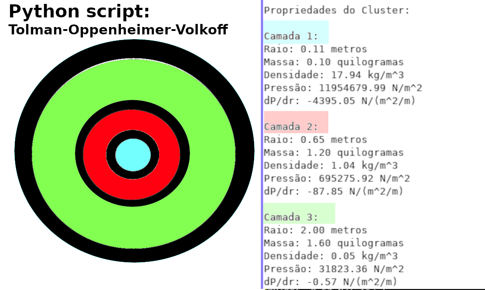

# Tolman-Oppenheimer-Volkoff (TOV) equation  
   - is a set of equations used to describe the structure and stability of a spherically symmetric, non-rotating,   
      and static object under the influence of gravity.   
       It provides the theoretical framework for understanding the maximum mass a compact object like a neutron star can   
        have before it collapses into a black hole.  

       To derive the TOV equation,   
        we need to start with the general relativistic equations of stellar structure, namely the Einstein field equations.   
         These equations describe how matter and energy curve the fabric of spacetime.   
          By assuming spherical symmetry and a static configuration,   
           we can simplify the equations and arrive at the TOV equation.  

 The TOV equation relates the pressure inside the compact object to its density and the gravitational field.   
      It essentially states that the pressure gradient must balance the gravitational force to maintain equilibrium.    
       The equation takes the form of a differential equation:    
  
    dP/dr = -G * (ε + P) * (M + 4πr^3P) / (r * (r - 2GM/c^2))  
  
   where dP/dr is the derivative of pressure with respect to radius,   
    G is the gravitational constant,   
    ε is the energy density,   
    P is the pressure,   
    M is the enclosed mass,   
    r is the radial coordinate,   
    c is the speed of light, and the terms (r - 2GM/c^2) and (M + 4πr^3P) arise from the spacetime curvature.  
  
 The TOV equation is a highly nonlinear differential equation that needs to be solved numerically.   
  One starts from the center of the object, where the density and pressure are known,   
   and integrates the equation outward until the surface of the object is reached.   
    During the integration, the enclosed mass M is also updated based on the mass density distribution.  
  
 The TOV equation provides insights into the maximum mass a neutron star can have before it collapses into a black hole.   
  When the central density of the object exceeds a critical value, known as the TOV limit,   
   the pressure gradient becomes unable to counterbalance the gravitational pull, and collapse occurs.  
  
It's important to note that creating a neutron star or any other object described by   
 the TOV equation is beyond our current technological capabilities.   
  The TOV equation is a theoretical framework used to understand the behavior of compact objects under extreme conditions and   
   is based on our understanding of general relativity and the properties of matter.  

   
# [PT-BR]
 - dP/dr = -G * (ε + P) * (M + 4πr^3P) / (r * (r - 2GM/c^2)),  
  - as variáveis são definidas da seguinte forma:  
    
     dP/dr é a taxa de variação da pressão em relação ao raio;
     G é a constante gravitacional;
     ε é a densidade de energia;
     P é a pressão;
     M é a massa contida no interior da esfera de raio r;
     r é o raio da esfera;
     c é a velocidade da luz no vácuo.

    - 1. Essas variáveis têm as seguintes interpretações:

     - A taxa de variação da pressão em relação ao raio (dP/dr)   
        mede a variação da pressão em cada ponto da esfera em relação à distância radial.  
         Ela indica como a pressão varia conforme nos afastamos ou nos aproximamos do centro do objeto.   

     - A constante gravitacional (G) é uma constante fundamental da natureza e é aproximadamente igual a 6,67430 × 10^(-11) m^3/(kg·s^2).  
       Ela desempenha um papel importante na descrição da força gravitacional.  
   
     - A densidade de energia (ε) representa a quantidade de energia contida em um determinado volume do objeto.  
        No contexto da equação de TOV, ela é a energia total por unidade de volume e inclui a contribuição da massa e da pressão.  
  
     - A pressão (P) é uma medida da força exercida pelo objeto em suas próprias partículas constituintes.  
        Ela surge devido às interações entre as partículas e é um fator crítico para a estabilidade e o equilíbrio do objeto.   

     - A massa contida no interior da esfera de raio r (M) é a massa total de matéria dentro da esfera considerada.   
        À medida que o raio r aumenta, mais massa está contida dentro da esfera, o que afeta a gravidade e a pressão.   

     - O raio da esfera (r) é a distância radial a partir do centro do objeto.  
        Ele determina a localização dentro do objeto e afeta como as variáveis, como pressão e densidade, mudam com a posição.  

     - A velocidade da luz no vácuo (c) é uma constante física fundamental, aproximadamente igual a 299,792,458 metros por segundo.  
        Ela é uma constante importante na teoria da relatividade geral e aparece na equação para levar em consideração os efeitos relativísticos do espaço-tempo.

    Essas são as interpretações básicas de cada variável na equação de TOV.  
     Cada variável desempenha um papel crucial na descrição da estrutura e estabilidade de objetos compactos,  
      como estrelas de nêutrons, e na compreensão dos efeitos da gravidade em escalas extremas.  

